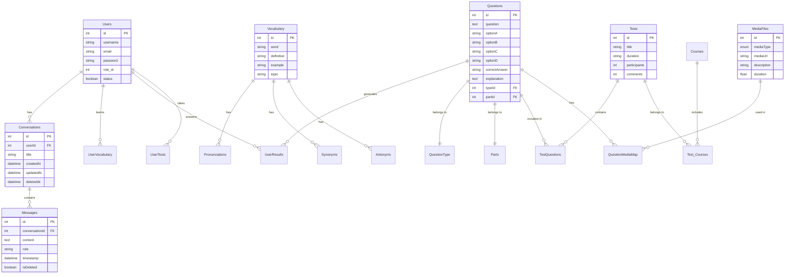

# Chatbot TOEIC ERD - Mermaid Format

```mermaid

erDiagram
    Users {
        int id PK
        string username
        string email
        string password
        int role_id
        boolean status
    }
    
    Conversations {
        int id PK
        int userId FK
        string title
        datetime createdAt
        datetime updatedAt
        datetime deletedAt
    }
    
    Messages {
        int id PK
        int conversationId FK
        text content
        string role
        datetime timestamp
        boolean isDeleted
    }
    
    Vocabulary {
        int id PK
        string word
        string definition
        string example
        string topic
    }
    
    Questions {
        int id PK
        text question
        string optionA
        string optionB
        string optionC
        string optionD
        string correctAnswer
        text explanation
        int typeId FK
        int partId FK
    }
    
    Tests {
        int id PK
        string title
        string duration
        int participants
        int comments
    }
    
    MediaFiles {
        int id PK
        enum mediaType
        string mediaUrl
        string description
        float duration
    }
    
    Users ||--o{ Conversations : "has"
    Conversations ||--o{ Messages : "contains"
    Users ||--o{ UserVocabulary : "learns"
    Users ||--o{ UserResults : "answers"
    Users ||--o{ UserTests : "takes"
    Vocabulary ||--o{ Pronunciations : "has"
    Vocabulary ||--o{ Synonyms : "has"
    Vocabulary ||--o{ Antonyms : "has"
    Questions ||--o{ UserResults : "generates"
    Questions ||--|| QuestionType : "belongs to"
    Questions ||--|| Parts : "belongs to"
    Tests ||--o{ TestQuestions : "contains"
    Questions ||--o{ TestQuestions : "included in"
    Tests ||--o{ Test_Courses : "belongs to"
    Courses ||--o{ Test_Courses : "includes"
    Questions ||--o{ QuestionMediaMap : "has"
    MediaFiles ||--o{ QuestionMediaMap : "used in"
```
