# 🧠 Chatbot TOEIC – Website Luyện Thi TOEIC Có Tích Hợp AI


**Chatbot TOEIC** là một nền tảng web hỗ trợ người dùng luyện thi TOEIC hiệu quả bằng các bài test được phân loại theo khóa học, phần thi và loại câu hỏi.  
Hệ thống tích hợp **chatbot AI** giúp người học tra cứu từ vựng và giải thích chi tiết đáp án, đồng thời cung cấp giao diện quản trị đầy đủ cho admin để quản lý đề thi, khóa học, người dùng và thống kê.

---

## 🚀 Tính năng nổi bật

- 📝 Làm bài thi TOEIC theo part hoặc full test có giới hạn thời gian
- 💬 Chatbot AI hỗ trợ giải thích đáp án, phân tích câu hỏi, giải nghĩa từ
- 📚 Tra cứu từ vựng TOEIC dễ dàng, kèm phát âm và nghĩa chi tiết
- 📊 Thống kê điểm số, xem lại lịch sử luyện thi
- 🧠 Quản lý đề thi, khóa học, người dùng (admin)
- 📁 Hỗ trợ import đề thi bằng CSV/JSON hoặc tạo trực tiếp

---

## 🐳 Hướng dẫn Build và Run bằng Docker

1. **Clone project về máy**:
```bash
git clone https://github.com/your-username/chatbot-toeic.git
cd chatbot-toeic
```

2. Tạo file .env và cấu hình biến môi trường:
# Ví dụ file .env
DB_USERNAME=sa
DB_PASS=1234567

3. Build và run bằng Docker Compose:
docker compose up --build

# hoặc lần sau chỉ cần:
docker compose up

4. Truy cập hệ thống:
- Frontend: http://localhost:5173
- Backend API: http://localhost:8080/api


---

## 🌐 Demo Online

Truy cập phiên bản demo tại: 👉 [https://hungptit.dev](https://hungptit.dev)

> ⚠️ Lưu ý: Một số tính năng như chatbot hoặc tra từ vựng có thể cần API Key hợp lệ để hoạt động chính xác.

## 📸 Giao diện Web (thư mục `img/`)

### 1. 🏠 Trang chủ người dùng – Danh sách đề thi luyện tập
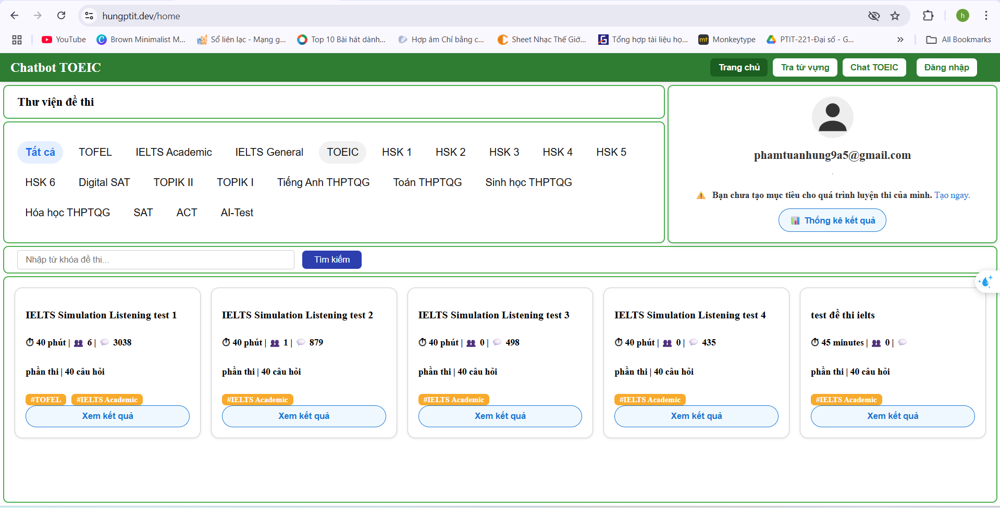

---

### 2. 🧪 Làm bài thi TOEIC – phân theo từng part, có đồng hồ đếm ngược
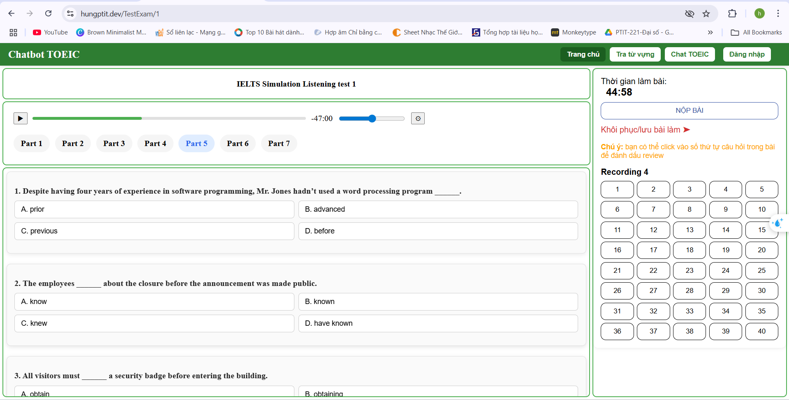

---

### 3. ✅ Kết quả bài làm – hiển thị câu đúng/sai và đáp án chính xác


---

### 4. 📖 Tra từ vựng TOEIC – nhiều nghĩa, ví dụ và phát âm
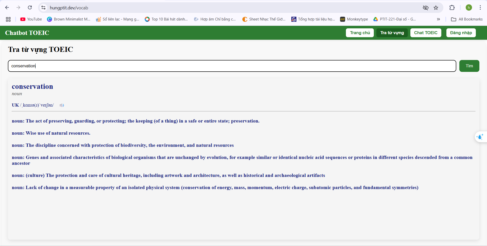

---

### 5. 💬 Chatbot TOEIC – giải thích ngữ pháp và đáp án
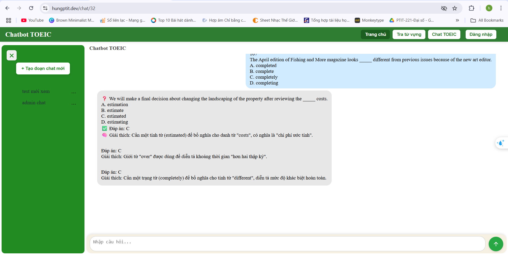

---

### 6. 📅 Lịch sử làm bài – thống kê kết quả và thời gian
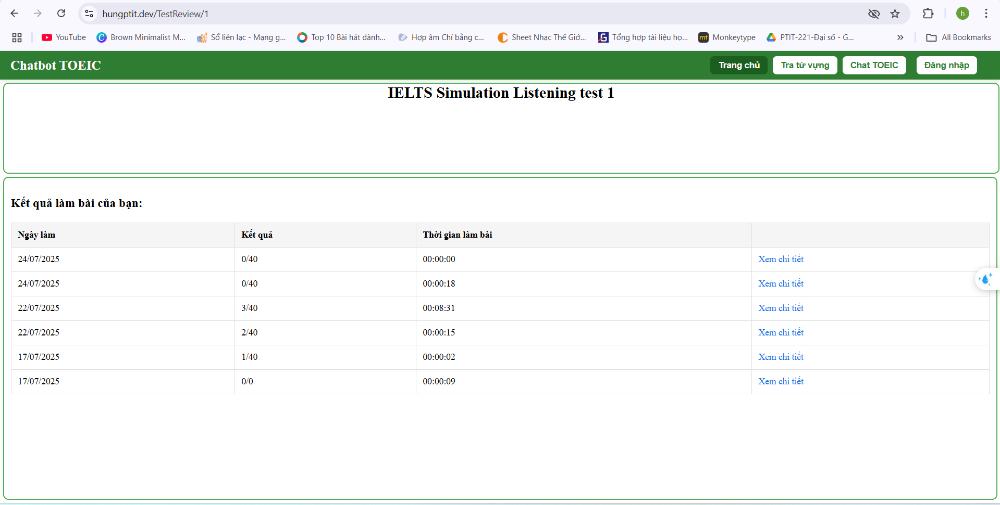

---

### 7. 📤 Tạo đề thi mới – chọn khóa học, phần thi và loại câu
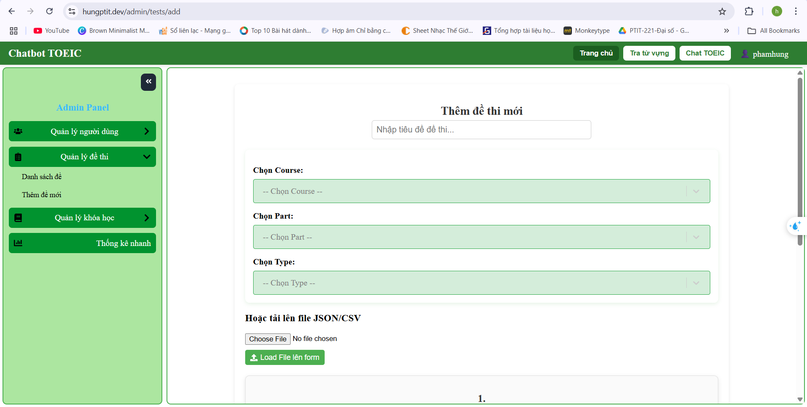

---

### 8. 📄 Quản lý đề thi – danh sách đề, số câu hỏi, số người làm
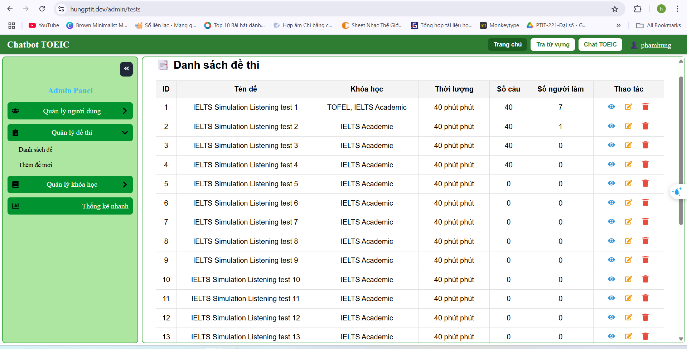

---

### 9. 📚 Quản lý khóa học – hiển thị các khóa học đang hoạt động
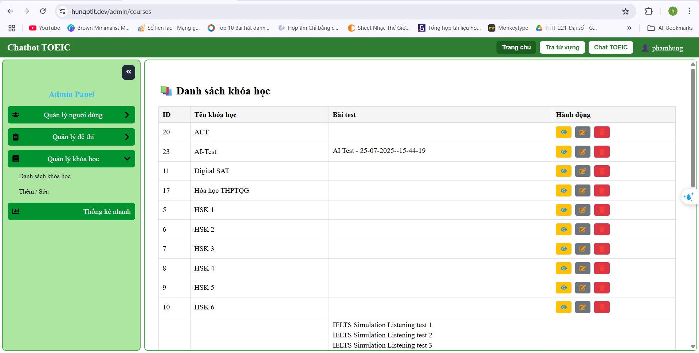

---

### 10. ➕ Thêm khóa học và loại câu hỏi
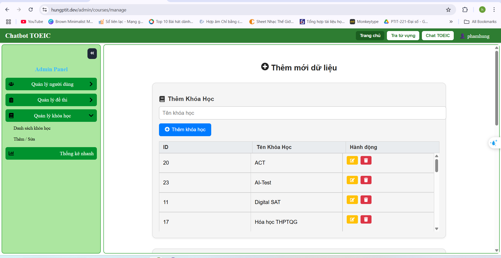

---

### 11. 👥 Quản lý người dùng – danh sách tài khoản
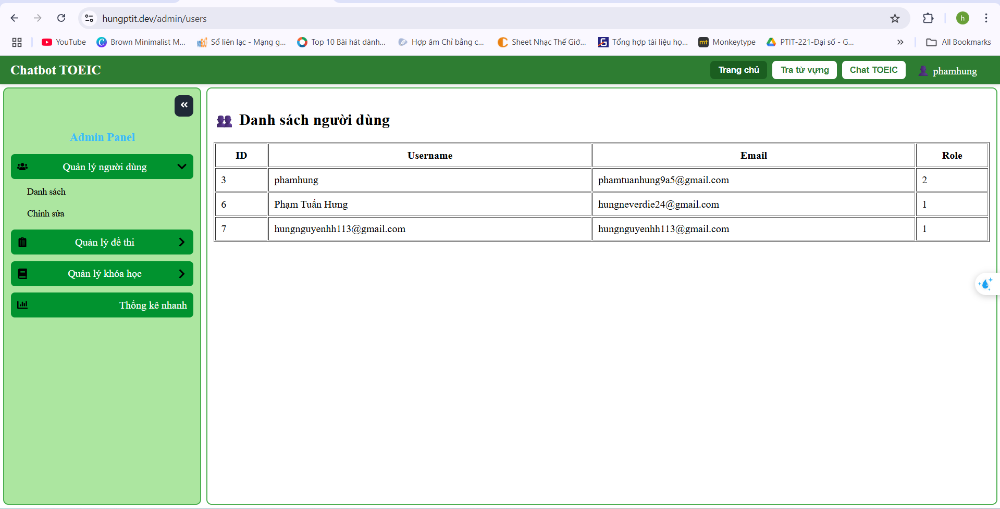

---

### 12. ✏️ Chỉnh sửa thông tin người dùng – đổi role, khóa tài khoản
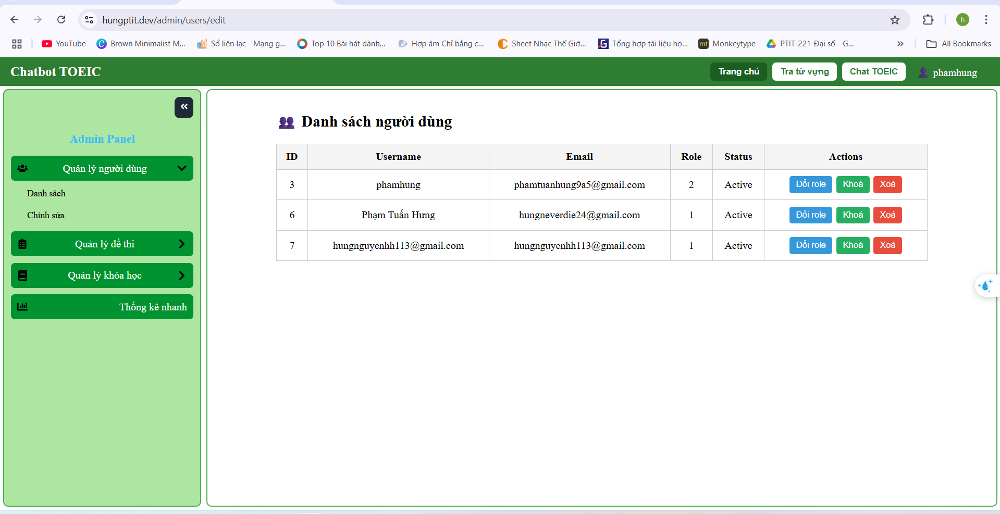

---

### 13. 👤 Trang cá nhân người dùng
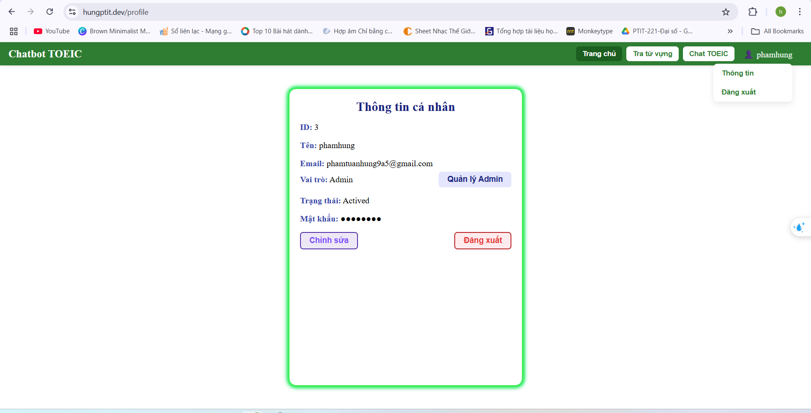

---

## 👨‍💻 Công nghệ sử dụng

- **Frontend**: ReactJS / Next.js
- **Backend**: Node.js / Express
- **AI & NLP**: Gemini API (hoặc OpenAI API) cho chatbot phân tích câu hỏi
- **Database**: SQL Server
- **Authentication**: JWT + phân quyền
- **Docker**: đóng gói toàn bộ app để triển khai dễ dàng

---

## 📫 Liên hệ phát triển

- Dev: [phamtuanhung9a5@gmail.com](mailto:phamtuanhung9a5@gmail.com)
- Trường: Học viện Công nghệ Bưu chính Viễn thông (PTIT)

---
